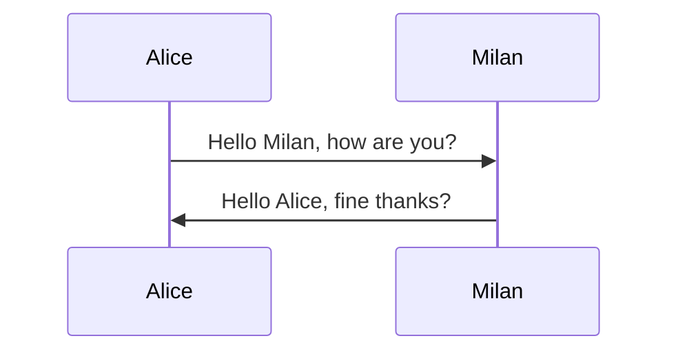
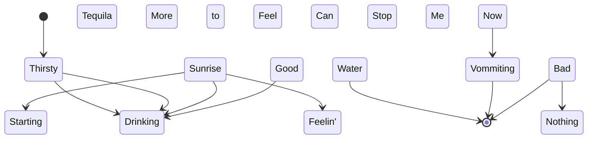

```mermaid
  graph TD;
      A-->B;
      A-->C;
      B-->D;
      C-->D;
```

```mermaid
  sequenceDiagram;
      participant A as Alice
      participant M as Milan
      A->>M: Hello Milan, how are you?
      M->>A: Hello Alice, fine thanks?
```

```mermaid
  stateDiagram-v2
[*] --> Thirsty
Thirsty --> Drinking Water
Drinking Water --> [*]
Thirsty --> Drinking Tequila Sunrise
Drinking Tequila Sunrise --> Drinking Tequila Sunrise
Drinking Tequila Sunrise --> Feelin' Good
Feelin' Good --> Drinking More Tequila Sunrise
Drinking More Tequila Sunrise --> Starting to Feel Bad
Starting to Feel Bad --> Nothing Can Stop Me Now
Nothing Can Stop Me Now --> Vommiting
Vommiting --> [*]
Starting to Feel Bad --> [*]
```
