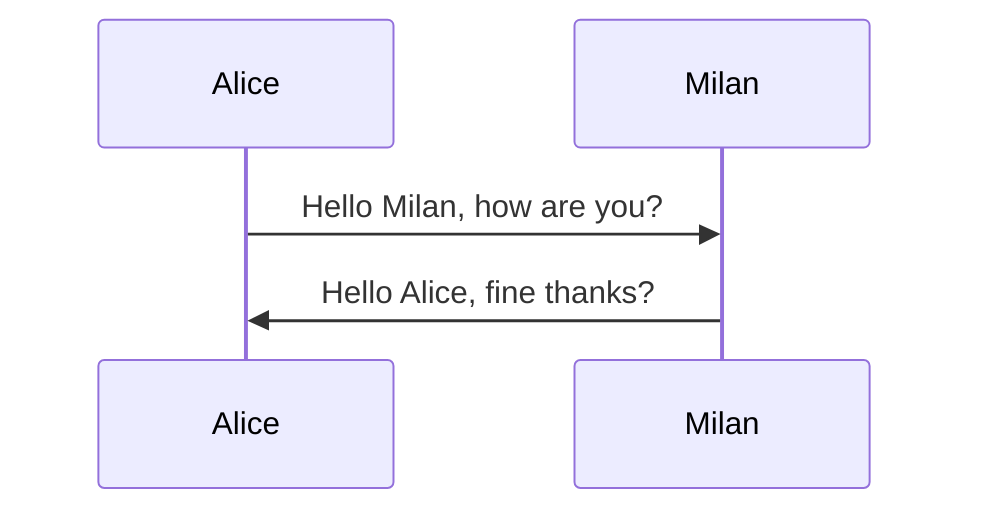
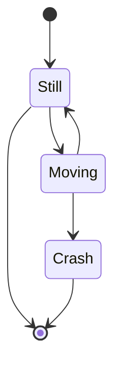

```mermaid
  graph TD;
      A-->B;
      A-->C;
      B-->D;
      C-->D;
```

```mermaid
  sequenceDiagram;
      participant A as Alice
      participant M as Milan
      A->>M: Hello Milan, how are you?
      M->>A: Hello Alice, fine thanks?
```

```mermaid
  stateDiagram-v2
[*] --> Still
Still --> [*]
Still --> Moving
Moving --> Still
Moving --> Crash
Crash --> [*]
```
