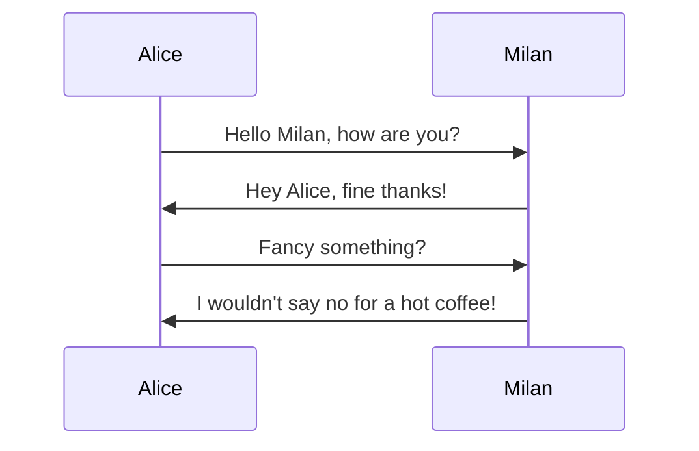
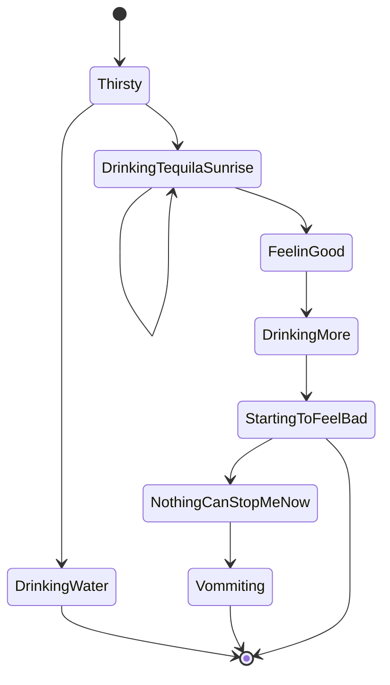

```mermaid
  graph TD;
      A-->B;
      A-->C;
      B-->D;
      C-->D;
```

```mermaid
  sequenceDiagram;
      participant A as Alice
      participant M as Milan
      A->>M: Hello Milan, how are you?
      M->>A: Hey Alice, fine thanks!
      A->>M: Fancy something?
      M->>A: I wouldn't say no for a hot coffee!
```

```mermaid
  stateDiagram-v2
    [*] --> Thirsty
    Thirsty --> DrinkingWater
    DrinkingWater --> [*]
    Thirsty --> DrinkingTequilaSunrise
    DrinkingTequilaSunrise --> DrinkingTequilaSunrise
    DrinkingTequilaSunrise --> FeelinGood
    FeelinGood --> DrinkingMore
    DrinkingMore --> StartingToFeelBad
    StartingToFeelBad --> NothingCanStopMeNow
    NothingCanStopMeNow --> Vommiting
    Vommiting --> [*]
    StartingToFeelBad --> [*]
```
